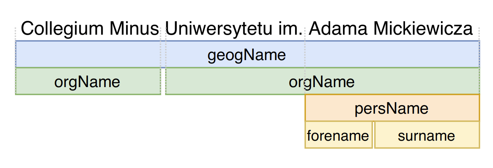

# About

This repository contains a list of tools and examples of their usage for named entity recognition.

# Index

1. [PolDeepNer2](pdn2)

# Maintainer

Michał Marcińczuk, CodeNLP <marcinczuk@gmail.com>
